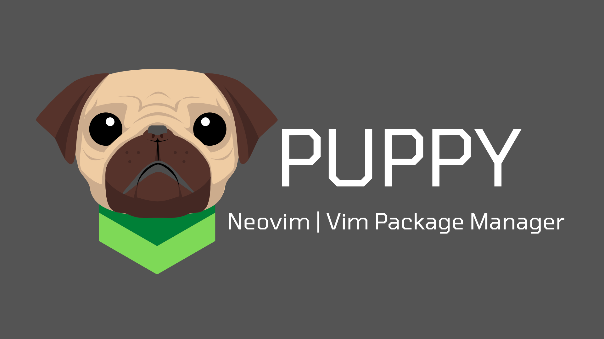

  

    
  

  <h1>The more faster package manager for Vim | Neovim</h1>
  
Powered by Golang and the Dogs Power

## ✅ Todo:

- [ ] Create configuration directory and file 
- [ ] Create read the puppy.json or multi format
- [ ] Logger and logs file 
- [ ] Create the basic clone function 
- [ ] Create the lock file 
- [ ] Check updates 
- [ ] Check package installed 
- [ ] Search a package 
- [ ] Delete a package 
- [ ] Command for delete 
- [ ] Do function 

> ⚠️ This tool is in development

---

Made with ❤ in Ecuador
